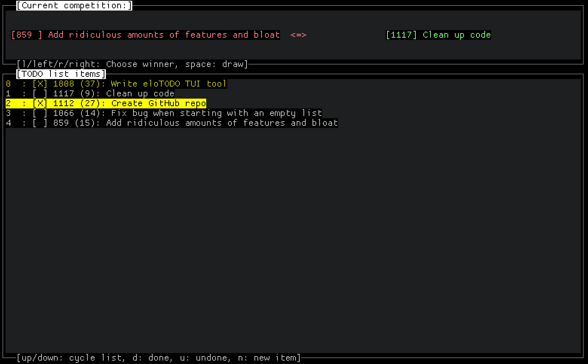

Elo Todo list



## Description

A small commandline tool to manage a TODO list. Directly inpired and in fact compatible with [Elo Anything!](https://github.com/bytes-zone/elo-anything), but using a TUI instead of a browser-based implementation.

The key idea and problem addressed here is:
 - Todo lists aways grow and never shrink
 - If you add stuff at the top, old stuff moves out of view and gets forgotten
 - If you add stuff at the bottom, they never get done
 - If you spend all your time reordering the list, you spend precious little time actually doing anything.

Instead, this list automatically sorts itself for you, by continuously scoring
tasks with an [Elo rating system](https://en.wikipedia.org/wiki/Elo_rating_system).
This is made as frictionless as possible, simply always offering you a scoring
choice at the top of the screen. *If* you do so conscientiously, your TODO list
will always be in importance order.


## Keyboard reference

 - ```Up``` / ```Down```: Move up and down the ranking list
 - ```Enter``` toggle the currently selected item to be "done" or "undone"
 - ```d``` / ```u``` explicitly set the currently selected item "done" or "undone"
 - ```Left``` / ```l``` / ``Right`` / ```r``` choose the left or right item of the current competition, respectively
 - ```Space``` skip the current competition, randomly select two new items
 - ```q``` quit
 - ```Shift-L``` reload Todo-list and rankings from the input file. (This also clears all checked items from the list)
 - ```a``` / ```n``` Add a new item to the list.

The json file is automatically updated and saved on every change.


## Technical info

eloTodo is implemented in Common Lisp, using [CL-TUI](https://github.com/naryl/cl-tui/) for its user interface and [jzon](https://github.com/Zulu-Inuoe/jzon) for reading and writing JSON.


